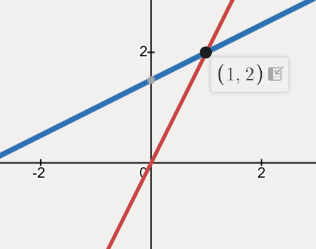
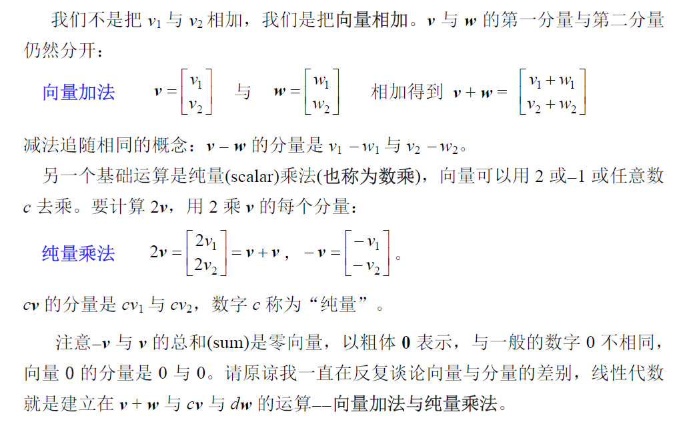
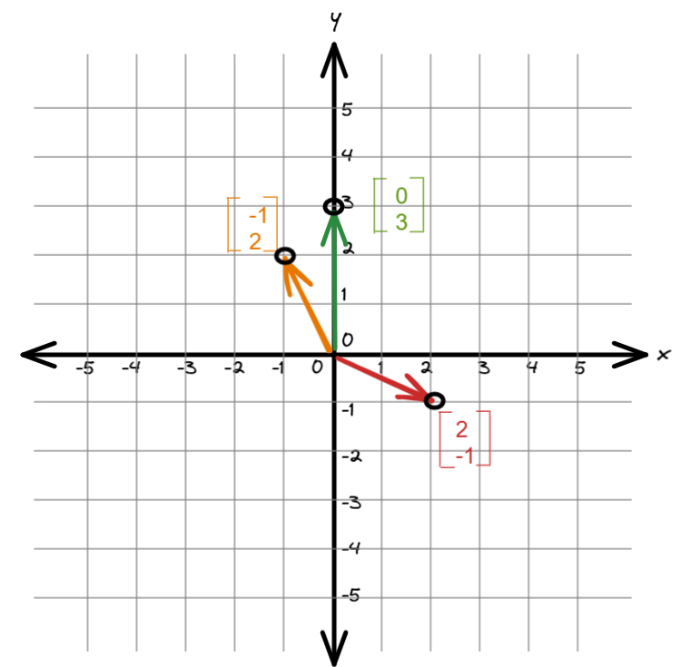
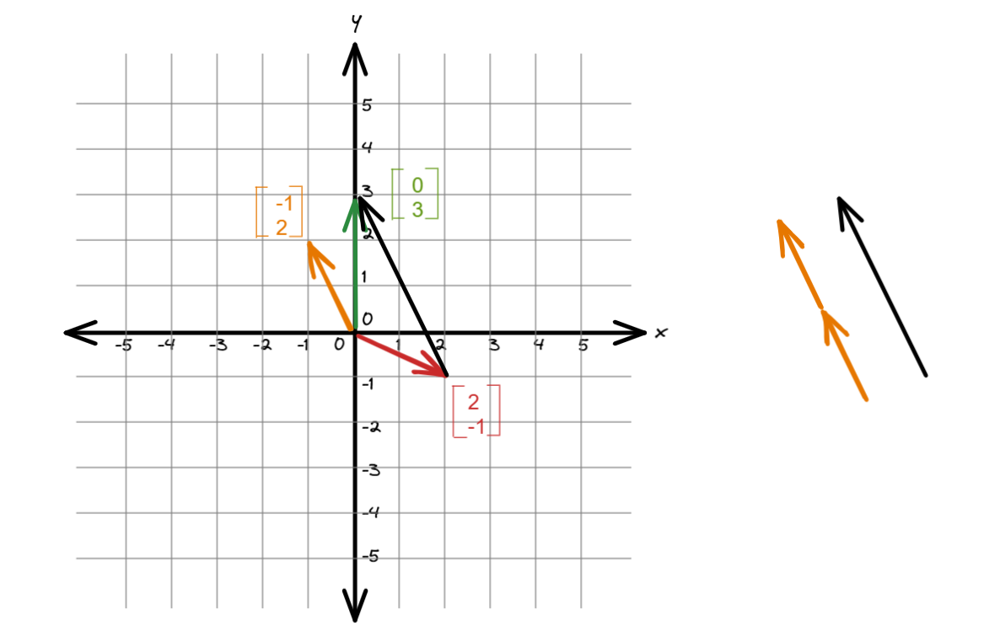

# 两方程两未知数

$$
\begin{align}
2x - y &= 0 \\
-x + 2y &= 3
\end{align}
$$

转换成==行==矩阵，见下：AX = B

$$
\begin{bmatrix}2&&-1\\-1&&2\end{bmatrix}\begin{bmatrix}x\\y\end{bmatrix}=\begin{bmatrix}0\\3\end{bmatrix}
$$

你可以这样看待，右边的未知数 x 和 y 已经排布好，接着就是将上边的不等式与之匹配。

第一个不等式 x 的系数为 2，y 的系数为 -1；第二个不等式 x 的系数为 -1，y 的系数为 2。x 和 y 自上而下，这些与之匹配的系数也就相应自上而下。

转换成==列==矩阵（以后就称线性组合），见下：
$$
x \begin{bmatrix} 2 \\ -1 \end{bmatrix} + y \begin{bmatrix} -1 \\ 2 \end{bmatrix} = \begin{bmatrix} 0 \\ 3 \end{bmatrix}
$$
那么 x 和 y 为多少，才让这个等式的成立具体化呢？当 x = 1，y = 2时。

记忆还不错的你，也应该看出这里的 x = 1，y = 2 就是之前两个方程的解，即交点。

想会计算？我们看几个公式：

前面讲的计算，是指已经知晓 x 和 y 值的情况下，向量的计算规则。但如何求得 x 和 y 的值呢？还没有讲到，前面只是直接给出答案。

以原点 (0,0) 为起始点，绘制出对应的直线：

我们暂且将绿线和红线的箭头连接起来，可以看到这条黑线是黄线的两倍。

因此，我们讲 x = 1，y = 2。

> [!TIP]
>
> 图中的几种颜色且有箭头的线在数学中称之为向量，如果不明白图中向量的运算，去补充向量的运算法则

# 三方程三未知数

$$
\begin{align}
2x - y &= 0 \\
-x + 2y -z &= -1 \\
-3y + 4z &= 0
\end{align}
$$

网站推荐：https://www.desmos.com/3d

后面学习如何求解，本节暂时无能为力，只是引出随着纬度增加，绘图的方式算不上明智之举。

# 矩阵相乘

Ax = b，求解 b：
$$
\begin{bmatrix}2&5\\1&3\end{bmatrix}\begin{bmatrix}1\\2\end{bmatrix}
$$
推荐方式，将行矩阵方式转换成列矩阵方式求解：
$$
\begin{bmatrix}2&5\\1&3\end{bmatrix}\begin{bmatrix}1\\2\end{bmatrix}=1\begin{bmatrix}2\\1\end{bmatrix}+2\begin{bmatrix}5\\3\end{bmatrix}=\begin{bmatrix}12\\7\end{bmatrix}
$$
x 中 第 1 个数 和 A 中 第 1 列相乘 + x 中 第 2 个数 和 A 中 第 2 列相乘 得到结果。

基于此规律，相比下次矩阵相乘也明白该怎么做了。

