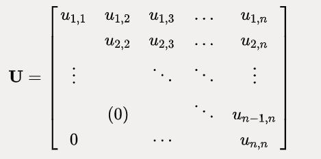
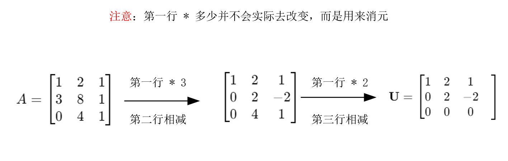
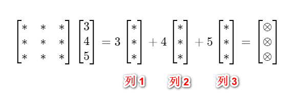
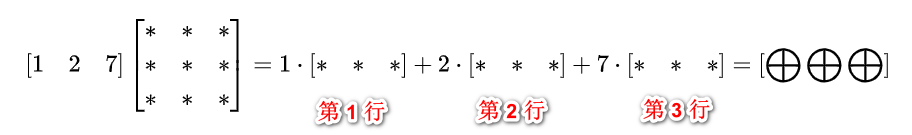
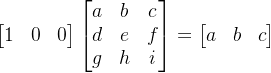
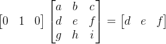
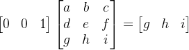
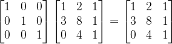
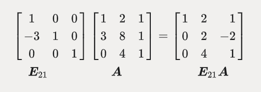
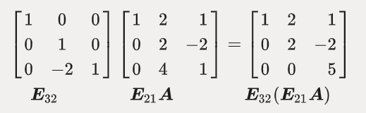

## 消元

消元法是计算机软件求解线形方程组所用的最常见的方法。任何情况下，只要是矩阵 A **可逆**，均可以通过消元法求得 `Ax=b` 的解。

高斯消元法就是通过对方程组中的某两个方程进行适当的数`乘`和`加`，以达到将某一未知数系数变为零，从而削减未知数个数的目的。

- 消元成功：矩阵的主元不包含 0， 也就是说，可逆矩阵
- 消元失败：矩阵的主元有至少一个 0，也就是说，不可逆矩阵

&nbsp;

求解目标：
$$
\begin{aligned}x+2y+z=2\\3x+8y+z=12\\4y+z=2\end{aligned}
$$
转换成 Ax = b 形式：
$$
A=\begin{bmatrix}1&2&1\\3&8&1\\0&4&1\end{bmatrix}\mathbf{b}=\begin{bmatrix}2\\12\\2\end{bmatrix}
$$
注意看这个矩阵，左上角的数字为 1，称其为“主元一”，是相当关键的。

通过消元将第一列中除了主元之外的数字均变化为0，寻找一种 **U矩阵** **（U upper triangular 上三角矩阵）**。就像下面这种：

操作方法就是用之后的每一行减去第一行的适当倍数。

可以看到下面计算之后，证明 A 是一个可逆矩阵。

需要说明的是，主元不能为0，如果恰好消元至某行，0出现在了主元的位置上，应当通过与下方的一行进行“行交换”使得非零数字出现在主元位置上。

如果0出现在了主元位置上，并且下方没有对等位置为非0数字的行，则消元终止，并证明矩阵A为不可逆矩阵，且线性方程组没有唯一解。

## 回代

做方程的高斯消元时，需要对等式右侧的**b**做同样的乘法和加减法。手工计算时比较有效率的方法是应用**增广矩阵**，将 **b** 插入矩阵 **A** 之后形成最后一列，在消元过程中带着 **b** 一起操作。

**前面介绍消元的基本思路，以后实际情况中需要将 b 插入矩阵 A 之后形成最后一列，在消元过程中带着 b 一起操作。**

&nbsp;
$$
\begin{bmatrix}1&2&1&2\\3&8&1&12\\0&4&1&2\end{bmatrix}\to\begin{bmatrix}1&2&1&2\\0&2&-2&6\\0&4&1&2\end{bmatrix}\to\begin{bmatrix}1&2&1&2\\0&2&-2&6\\0&0&5&-10\end{bmatrix}
$$
等价于：
$$
\begin{align*}
x + 2y + z &= 2 \\
2y - 2z &= 6 \\
5z &= -10
\end{align*}
$$
z = -2，y = 1，x = 2 

## 消元矩阵

消元矩阵，就是将前面演示的消元过程中的行变换转化为矩阵之间的乘法形式。

即用矩阵描述消元过程。

&nbsp;

一列 乘以 一个矩阵，结果是一列

一行 乘以 一个矩阵，结果是一行

然后，我们来观察下面这个规律：

所以，如果我们的矩阵是下面这个形式，与原矩阵相乘将不会改变原矩阵，我们称呼这个矩阵为单元矩阵：

&nbsp;

我们下面来求解左边的内容：
$$
\begin{bmatrix}&&\\&&\\&&\end{bmatrix}\begin{bmatrix}1&2&1\\3&8&1\\0&4&1\end{bmatrix}=\begin{bmatrix}1&2&1\\0&2&-2\\0&4&1\end{bmatrix}
$$
结合前面的知识，我们能很快写出第一行和第三行，因为这两行并没有变化。
$$
\begin{bmatrix}1&0&0\\&&\\0&0&1\end{bmatrix}\begin{bmatrix}1&2&1\\3&8&1\\0&4&1\end{bmatrix}=\begin{bmatrix}1&2&1\\0&2&-2\\0&4&1\end{bmatrix}
$$
关键是看第二行：
$$
[-3\quad1\quad0]\begin{bmatrix}1&2&1\\3&8&1\\0&4&1\end{bmatrix}&=&\begin{array}{cccc}-&3&[1&2&1]\\+&1&[3&8&1]\\+&0&[0&4&1]\end{array}=[\begin{array}{ccc}0&2&-2\end{array}]
$$
即：

左乘的这个矩阵为称为初等矩阵（E），E~21~ 表示将矩阵A的第2行第1列的位置变为0的消元矩阵。

接着，我们看到 E~21~A 第三行第二列还有个 4，要寻找一种 **U矩阵** ，得将其变换为 0，见下图：

我们将这两步综合起来，即 E~32~(E~21~A) = U ，也就是说如果我们想从 A 矩阵直接得到 U 矩阵的话，只需要 E~32~(E~21~A) 即可。

你可以看到，我们这里一直是在左乘，先是 E~21~A，即 A 左乘一个 E~21~；再是 E~32~(E~21~A)，即 E~21~A 左乘一个 E~32~。

之所以如此，是有个概念得讲：在一个矩阵A的左边乘一个矩阵（简称左乘），就是对 A 进行行变换，而在 A 右边乘一个矩阵（简称右乘），就是对A进行列变换。

> [!NOTE]
>
> 矩阵乘法满足结合律，但不满足交换律

## 置换矩阵

用矩阵相乘来完成矩阵的行交换与列交换，而用到的矩阵叫做置换矩阵。

行交换：
$$
{\begin{bmatrix}0&1\\1&0\end{bmatrix}\begin{bmatrix}a&b\\c&d\end{bmatrix}=\begin{bmatrix}c&d\\a&b\end{bmatrix}}
$$
列交换：
$$
\begin{bmatrix}a&b\\c&d\end{bmatrix}\begin{bmatrix}0&1\\1&0\end{bmatrix}=\begin{bmatrix}b&a\\d&c\end{bmatrix}
$$
即**左乘行交换，右乘列交换**。

> [!CAUTION]
>
> 左右乘效果不同也展示了矩阵运算不符合交换律的性质。

## 逆矩阵

把一个消元结束的 **矩阵 U** 如何变为 未经消元的 **矩阵 A** 呢？即乘上一个逆矩阵！
$$
[?]\begin{bmatrix}1&0&0\\-3&1&0\\0&0&1\end{bmatrix}=\begin{bmatrix}1&0&0\\0&1&0\\0&0&1\end{bmatrix}
$$

就以之前的 E~21~ 举例，这次变换是从第二行中减去三倍的第一行，那么其逆变换就是给第二行加上三倍的第一行，所以逆矩阵（上面的 ?）如下：
$$
\begin{bmatrix}1&0&0\\3&1&0\\0&0&1\end{bmatrix}
$$
我们把矩阵 **E** 的逆记作 **E^−1^** ，所以有 **E^−1^E = I**

## 参考链接

[矩阵消元法](https://blog.csdn.net/LJM1200/article/details/128180306)

[线性代数笔记第02讲 矩阵消元](https://www.cnblogs.com/horizonshd/p/15365988.html)

[MIT—线性代数笔记02 矩阵消元](https://zhuanlan.zhihu.com/p/45717944)
